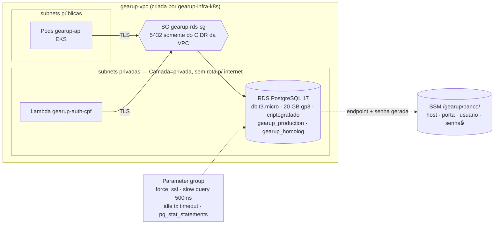
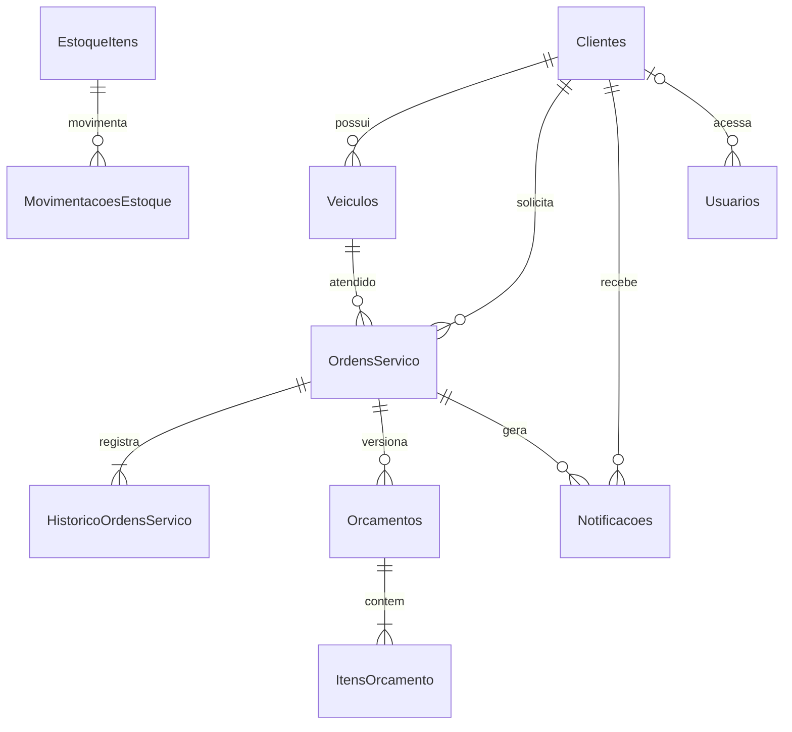

# gearup-infra-db

Banco de dados gerenciado da plataforma **GearUp** (Tech Challenge FIAP — Fase 3): **Amazon RDS for PostgreSQL 17**, provisionado com Terraform.

## Propósito

- Instância RDS PostgreSQL em subnets privadas, criptografada, com TLS obrigatório e backup automático.
- Parameter group ajustado para consistência e diagnóstico de performance.
- Senha master gerada pelo Terraform e publicada, junto com os dados de conexão, no **SSM Parameter Store** — fonte única para a API (pipeline do GearUp) e para a Lambda de autenticação.

A **instância** é responsabilidade deste repositório; o **schema** (tabelas, índices, constraints) evolui com o código, via migrations do EF Core no repositório [GearUp](https://github.com/SOAT-GearUp/GearUp). Justificativa da escolha do banco e modelagem completa (diagrama ER, relacionamentos, índices e constraints):

- [RFC-002 — Banco de dados gerenciado](https://github.com/SOAT-GearUp/GearUp/blob/master/docs/fase-3/RFC/RFC-002%20-%20Banco%20de%20dados%20gerenciado.md)
- [Modelagem e Justificativa](https://github.com/SOAT-GearUp/GearUp/blob/master/docs/fase-3/Banco%20de%20Dados/Modelagem%20e%20Justificativa.md)

## Arquitetura





(Diagrama completo, com colunas e constraints, na documentação de modelagem.)

## Tecnologias

Terraform ≥ 1.10 (providers `aws` 6.x e `random` 3.x) · Amazon RDS for PostgreSQL · AWS SSM Parameter Store · GitHub Actions · state em S3 com lock nativo.

## Pré-requisito

A VPC do [gearup-infra-k8s](https://github.com/SOAT-GearUp/gearup-infra-k8s) já aplicada. Ela é encontrada pela tag `Name = gearup-vpc` e as subnets por `Camada = privada` — este repositório não lê o state do outro.

## CI/CD

Workflow [`terraform.yml`](.github/workflows/terraform.yml):

| Evento | O que roda | Ambiente GitHub |
|---|---|---|
| Pull Request | `fmt -check`, `validate`, `plan` | homolog |
| push `homolog` | `plan` contra a conta real | homolog |
| push `main` (só via PR) | `apply` | production |
| Run workflow → `apply` / `destroy` | manual | production |

A instância é compartilhada pelos ambientes (um database por ambiente), por isso `homolog` valida e só `main` aplica ([RFC-001](https://github.com/SOAT-GearUp/GearUp/blob/master/docs/fase-3/RFC/RFC-001%20-%20Nuvem%20e%20estrategia%20de%20ambientes.md)).

**Secrets:** `AWS_ACCESS_KEY_ID`, `AWS_SECRET_ACCESS_KEY`, `AWS_SESSION_TOKEN` (Learner Lab → AWS Details; expiram a cada sessão).

## Execução local

Windows PowerShell 5.1, credenciais do lab em `%USERPROFILE%\.aws\credentials`:

```powershell
.\scripts\tf-init.ps1
terraform -chdir=terraform plan
terraform -chdir=terraform apply        # ~8 min

# Conferir o que foi publicado para os consumidores
aws ssm get-parameters-by-path --path /gearup/banco --query "Parameters[].Name"
```

Bash: `bash scripts/tf-init.sh terraform`.

O banco **não é acessível de fora da VPC**. Para inspecionar dados, use um pod temporário no cluster:

```powershell
$senha = aws ssm get-parameter --name /gearup/banco/senha --with-decryption --query Parameter.Value --output text
$hostDb = aws ssm get-parameter --name /gearup/banco/host --query Parameter.Value --output text
kubectl run psql --rm -it --restart=Never --image=postgres:17-alpine --env="PGPASSWORD=$senha" -- psql "host=$hostDb dbname=gearup_homolog user=gearup sslmode=require"
```

## Contrato publicado no SSM

| Parâmetro | Tipo | Conteúdo |
|---|---|---|
| `/gearup/banco/host` | String | endpoint do RDS |
| `/gearup/banco/porta` | String | 5432 |
| `/gearup/banco/usuario` | String | usuário master |
| `/gearup/banco/senha` | SecureString | senha gerada (32 caracteres) |

Consumidores: pipeline `CD` do GearUp (monta o Secret do Kubernetes) e Terraform do gearup-lambda-auth (variáveis da Lambda).

## Destroy

Antes do `gearup-infra-k8s` e depois do GearUp e do gearup-lambda-auth:

```powershell
terraform -chdir=terraform destroy
```

## Custos

db.t3.micro single-AZ ~US$ 0,018/h + 20 GB gp3 ~US$ 0,08/dia. **O RDS cobra com o lab parado** — destrua ao fim da sessão.

## Swagger / Postman

Este repositório não expõe APIs. Ver [GearUp](https://github.com/SOAT-GearUp/GearUp#apis-swagger-e-postman).
